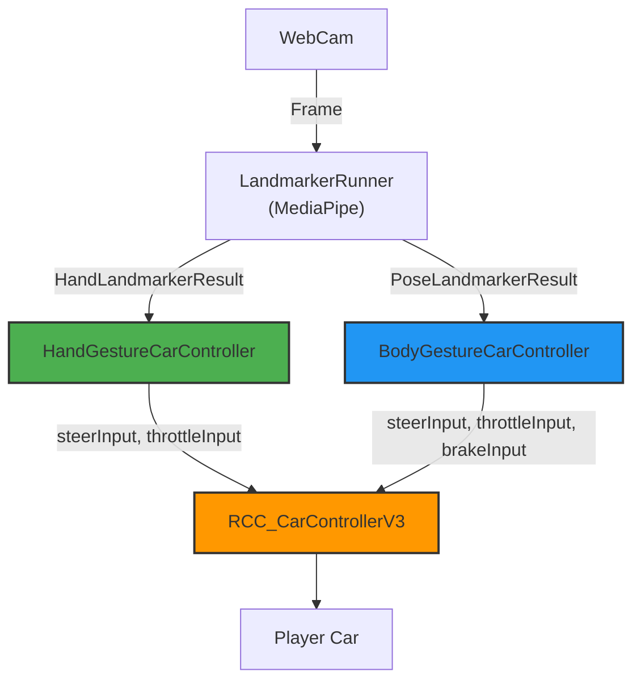

# Highway Racer Gesture Control - Technical Design

This document describes the technical implementation of the gesture control system for the Highway Racer Unity project.

## 1. System Overview

The control system allows the player to control a racing car using hand or body gestures detected via webcam. The core components work together to process camera input, detect landmarks, and translate them into car controls.

### Control Modes

| Mode | Tracking | Controls |
|------|----------|----------|
| **Hand Mode** | 21-point hand landmarks | Steering only (auto-throttle) |
| **Body Mode** | 33-point pose landmarks | Steering + Acceleration + Braking |

## 2. Data Flow Architecture



## 3. Component Breakdown

### 3.1 HandLandmarkerRunner

**File**: `Assets/Highway Racer/Scripts/MediaPipe/HandLandmarkerRunner.cs`

**Responsibilities**:
- Initializes MediaPipe Hand Landmarker task
- Manages webcam feed and texture pool
- Processes frames asynchronously
- Forwards `HandLandmarkerResult` to gesture controller

**Key Configuration**:
- `numHands`: 2 (detects up to 2 hands)
- `minHandDetectionConfidence`: 0.5
- `minTrackingConfidence`: 0.5

### 3.2 HandGestureCarController

**File**: `Assets/Highway Racer/Scripts/MediaPipe/HandGestureCarController.cs`

**Responsibilities**:
- Receives 21-point hand landmarks
- Uses wrist position (landmark 0) for steering calculation
- Applies constant throttle (auto-speed mode)
- Outputs: `steerInput` (-1 to 1), `throttleInput` (0 to 1)

**Steering Logic**:

```
Wrist X Position:
  - X < 0.5: Hand is on left side → Steer Left (negative)
  - X > 0.5: Hand is on right side → Steer Right (positive)
  - X ≈ 0.5: Hand is centered → No steering (dead zone)

Formula:
  xOffset = -(handPosition.x - 0.5)  // Inverted for mirrored camera
  targetSteer = xOffset * steerSensitivity
```

**Key Parameters**:

| Parameter | Default | Description |
|-----------|---------|-------------|
| `autoThrottle` | 0.5 | Constant throttle value |
| `steerSensitivity` | 2.0 | Steering multiplier |
| `deadZone` | 0.1 | Center dead zone |
| `steerSmoothing` | 8.0 | Lerp smoothing factor |

### 3.3 BodyLandmarkerRunner

**File**: `Assets/Highway Racer/Scripts/MediaPipe/BodyLandmarkerRunner.cs`

**Responsibilities**:
- Initializes MediaPipe Pose Landmarker task
- Manages webcam feed for pose detection
- Forwards `PoseLandmarkerResult` to body controller

### 3.4 BodyGestureCarController

**File**: `Assets/Highway Racer/Scripts/MediaPipe/BodyGestureCarController.cs`

**Responsibilities**:
- Receives 33-point pose landmarks
- Uses nose position (landmark 0) for steering and acceleration
- Outputs: `steerInput`, `throttleInput`, `brakeInput`

**Movement Logic**:

```
Nose X Position (Steering):
  - X < 0.5: Lean left → Steer Left
  - X > 0.5: Lean right → Steer Right

Nose Y Position (Acceleration):
  - Y < 0.5: Move up → Accelerate
  - Y > 0.5: Move down → Brake
```

**Key Parameters**:

| Parameter | Default | Description |
|-----------|---------|-------------|
| `steerSensitivity` | 2.0 | Steering response |
| `leanThreshold` | 0.05 | Dead zone for lean detection |

## 4. Car Integration

### RCC_CarControllerV3 Interface

The gesture controllers interface with the Realistic Car Controller (RCC) via external control mode:

```csharp
// Enable external control
targetCar.externalController = true;

// Apply inputs
targetCar.steerInput = currentSteer;    // -1 to 1
targetCar.throttleInput = currentGas;   // 0 to 1
targetCar.brakeInput = currentBrake;    // 0 to 1
```

## 5. Coordinate System

MediaPipe uses normalized coordinates:
- Origin `(0, 0)` is **Top-Left**
- `(1, 1)` is **Bottom-Right**
- Center is `(0.5, 0.5)`

### Camera Mirroring

For a natural user experience, the camera feed is typically mirrored:
- Moving your hand **left** should steer the car **left**
- The steering calculation inverts X: `xOffset = -(x - 0.5)`

## 6. Visualization

Both controllers include debug visualization:

### Hand Mode Debug
- Hand skeleton with 21 joints and bone connections
- Wrist highlighted in red (control point)
- Debug panel showing tracking status and steer values

### Body Mode Debug
- 33-point pose skeleton
- Bone connections for arms, legs, and torso
- Steer and gas/brake visual bars

## 7. Configuration Parameters Summary

### Hand Controller

| Parameter | Type | Default | Range | Description |
|-----------|------|---------|-------|-------------|
| `autoThrottle` | float | 0.5 | 0-1 | Constant throttle |
| `useAutoSpeed` | bool | true | - | Enable auto throttle |
| `steerSensitivity` | float | 2.0 | 0.5-5 | Steering sensitivity |
| `deadZone` | float | 0.1 | 0-0.3 | Center dead zone |
| `steerSmoothing` | float | 8.0 | 1-20 | Smoothing factor |
| `showDebugUI` | bool | true | - | Show debug panel |
| `showLandmarks` | bool | true | - | Draw hand skeleton |

### Body Controller

| Parameter | Type | Default | Description |
|-----------|------|---------|-------------|
| `steerSensitivity` | float | 2.0 | Steering sensitivity |
| `leanThreshold` | float | 0.05 | Dead zone for detection |
| `accelThreshold` | float | 0.4 | Acceleration threshold |

## 8. File Structure

```
Assets/Highway Racer/Scripts/MediaPipe/
├── HandGestureCarController.cs   # Hand → Steering
├── HandLandmarkerRunner.cs       # MediaPipe Hand wrapper
├── BodyGestureCarController.cs   # Body → Full control
└── BodyLandmarkerRunner.cs       # MediaPipe Pose wrapper

Assets/PoseLandmarkSDK/
└── Runtime/Scripts/              # Pose detection SDK

Assets/StreamingAssets/
└── mediapipe/                    # Model files (.tflite)
```

## 9. Future Enhancements

- [ ] Gesture-based lane switching (fist = change lane)
- [ ] Two-hand steering (steering wheel gesture)
- [ ] Voice commands integration
- [ ] Calibration system for different user positions
